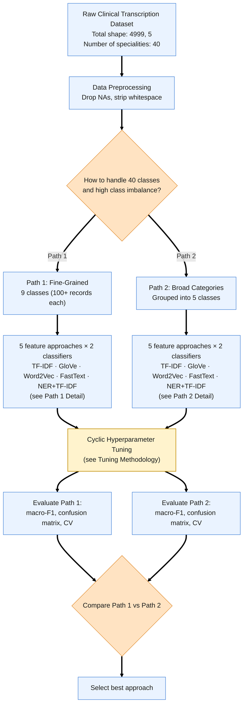
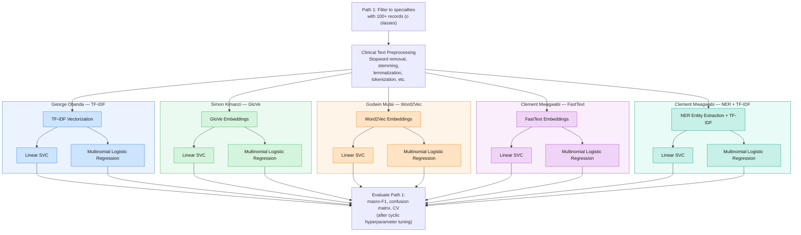
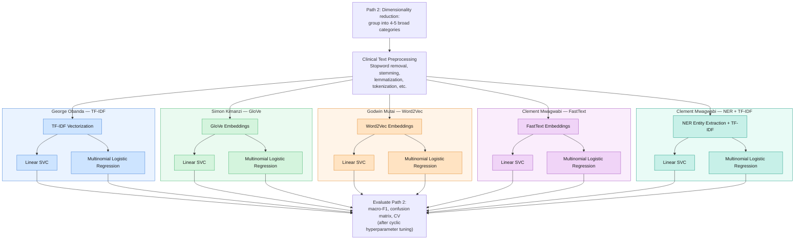
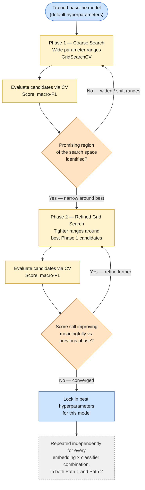
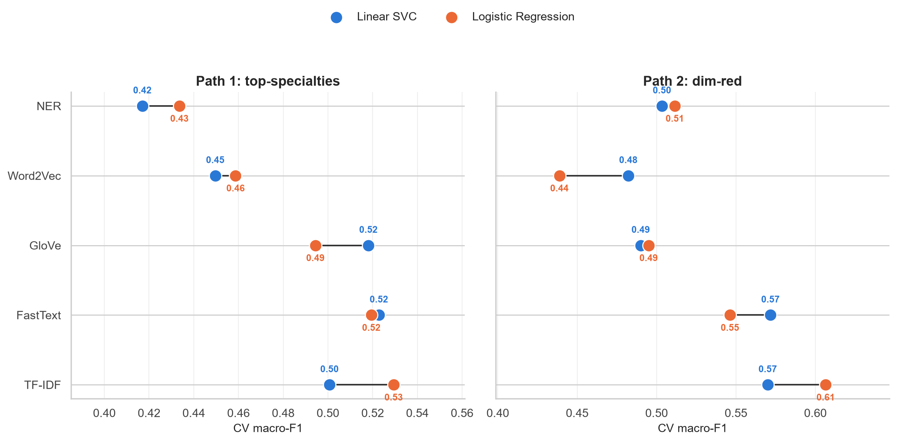
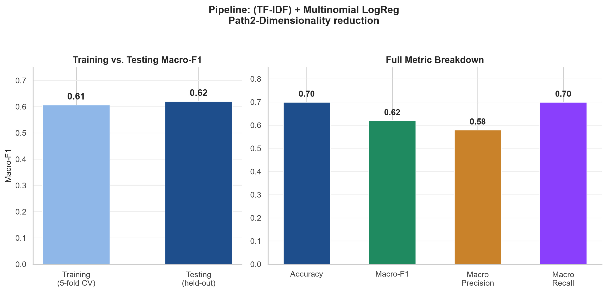

# 0. Sections
1. Project
2. Dataset
3. Contents
4. Methods and processing
5. Results and conclusions

# 1. Project
Title: Clinical Text Mining

Dates: July - August 2026

Description: The purpose of this project is to carry out clinical text mining to enable us to predict medical specialties required from a transcript of a patient's visit to the hospital.

Contributors:
- Godwin Mutai
- Simon kimanzi
- George Obanda
- Clement Mwagwabi

Funding Organisation: The training and platform to do this work was provided by Eneza Data Science

# 2. Dataset
The dataset utilised in this project is the [mtsamples dataset by Hugging Face](https://huggingface.co/datasets/harishnair04/mtsamples).

Description: The dataset contains 4999 rows of de-identified patient transcripts data from a hospital visit, labelled with the medical specialty they required - determined by a specialist.

The features include:
- `description`: An overview description of the patient's condition
- `medical_specialty`: The medical specialty a patient's condition belonged to.
- `sample_name`: The type of sample (if any) collected from the patient during their visit.
- `transcription`: The full, indepth transcription of the patients visit from the arrival at the facility, to the tests carried out etc.
- `keywords`: Keywords identified from the transcription information.

# 3. Content
The project directory looks like this

```
.
├── CONTRIBUTING.md                                   <- Contributing file to set up this environment and contribute to it.
├── README.md                                         <- This file
├── requirements.txt                                  <- Python dependencies for this project
├── plots                                             <- All necessary figures from this project
│   ├── all_classes_top_highlighted.png
│   ├── classification_report_by_f1.png
│   ├── full_classes_by_superclasses.png
│   ├── metrics_heatmap.png
│   ├── PCA_TFIDF.png
│   ├── precision_recall_tradeoff.png
│   ├── super_class_distribution.png
│   ├── TFIDF_LogisticRegression_ConfusionMatrix.png
│   └── top_classes.png
├── results                                      
│   ├── collected_metrics.csv                         <- A CSV file of all collected metrices from model training and testing (Used for reporting)
│   └── results.ipynb                                 <- A results notebook for any metric analysis (Used for reporting)
└── src                                               <- Main analysis folder
    ├── data_cleaning.ipynb                           <- Data cleaning module. This is also where the two pathway data is generated
    ├── fasttext_dim_red.ipynb                        <- ML algorithm using fasttext to determine feature representation for pathway 2
    ├── fasttext_top.ipynb                            <- ML algorithm using fasttext to determine feature representation for pathway 1
    ├── glove_dim_red.ipynb                           <- ML algorithm using glove to determine feature representation for pathway 2
    ├── glove_top.ipynb                               <- ML algorithm using glove to determine feature representation for pathway 1
    ├── ner_dim_red.ipynb                             <- ML algorithm using SpaCy's Named Entity Recognition to determine feature representation for pathway 2
    ├── ner_top.ipynb                                 <- ML algorithm using SpaCy's NER to determine feature representation for pathway 1
    ├── tfidf_dim_red.ipynb                           <- ML algorithm using naive TF-IDF to determine feature representation for pathway 2
    ├── tfidf_top.ipynb                               <- ML algorithm using naive TF-IDF to determine feature representation for pathway 1
    ├── word2vec_dim_red.ipynb                        <- ML algorithm using Word2Vec to determine feature representation for pathway 2
    └── word2vec_top.ipynb                            <- ML algorithm using Word2Vec to determine feature representation for pathway 1
```

# 4. Methods and processing

## Project overview

To achieve the objectives of the study, we sought to carry out the following steps.


## Path 1 - Top medical specialities


## Path 2 - Dimensionality reduction


## Hyperparameter tuning option


## The full project in context

```mermaid
flowchart TD
    A["Raw Clinical Transcription Dataset<br/>Total shape: 4999, 5<br/>Number of specialities: 40"] --> B["Data Preprocessing<br/>Dropping the NAs from the transcript<br/>Strip whitespace from the medical speciality column"]
    B --> C{"Decision Point:<br/>How to handle 40 classes?<br/>How to deal with the high class imbalance"}
    C -->|Path 1| D["Filter to specialties<br/>with 100+ records<br/>(9 classes, keep granularity)"]
    C -->|Path 2| E["Dimensionality reduction:<br/>group into 5<br/>broad categories"]
 
    D --> D_pre["Clinical Text Preprocessing<br/>Stopword removal, stemming,<br/>lemmatization, tokenization, etc."]
    E --> E_pre["Clinical Text Preprocessing<br/>Stopword removal, stemming,<br/>lemmatization, tokenization, etc."]
 
    subgraph Path1["Path 1 — Fine-Grained (9 Classes)"]
        direction LR
        subgraph P1_A["George Obanda — TF-IDF"]
            direction TB
            TI_D[TF-IDF Vectorization]
            TI_D_svc[Linear SVC]
            TI_D_lr[Multinomial Logistic Regression]
            TI_D --> TI_D_svc
            TI_D --> TI_D_lr
        end
        subgraph P1_B["Simon Kimanzi — GloVe"]
            direction TB
            GV_D[GloVe Embeddings]
            GV_D_svc[Linear SVC]
            GV_D_lr[Multinomial Logistic Regression]
            GV_D --> GV_D_svc
            GV_D --> GV_D_lr
        end
        subgraph P1_C["Godwin Mutai — Word2Vec"]
            direction TB
            WV_D[Word2Vec Embeddings]
            WV_D_svc[Linear SVC]
            WV_D_lr[Multinomial Logistic Regression]
            WV_D --> WV_D_svc
            WV_D --> WV_D_lr
        end
        subgraph P1_D["Clement Mwagwabi — FastText"]
            direction TB
            FT_D[FastText Embeddings]
            FT_D_svc[Linear SVC]
            FT_D_lr[Multinomial Logistic Regression]
            FT_D --> FT_D_svc
            FT_D --> FT_D_lr
        end
        subgraph P1_E["Clement Mwagwabi — NER + TF-IDF"]
            direction TB
            NER_D[NER Entity Extraction + TF-IDF]
            NER_D_svc[Linear SVC]
            NER_D_lr[Multinomial Logistic Regression]
            NER_D --> NER_D_svc
            NER_D --> NER_D_lr
        end
    end
 
    subgraph Path2["Path 2 — Broad Categories (5 Classes)"]
        direction LR
        subgraph P2_A["George Obanda — TF-IDF"]
            direction TB
            TI_E[TF-IDF Vectorization]
            TI_E_svc[Linear SVC]
            TI_E_lr[Multinomial Logistic Regression]
            TI_E --> TI_E_svc
            TI_E --> TI_E_lr
        end
        subgraph P2_B["Simon Kimanzi — GloVe"]
            direction TB
            GV_E[GloVe Embeddings]
            GV_E_svc[Linear SVC]
            GV_E_lr[Multinomial Logistic Regression]
            GV_E --> GV_E_svc
            GV_E --> GV_E_lr
        end
        subgraph P2_C["Godwin Mutai — Word2Vec"]
            direction TB
            WV_E[Word2Vec Embeddings]
            WV_E_svc[Linear SVC]
            WV_E_lr[Multinomial Logistic Regression]
            WV_E --> WV_E_svc
            WV_E --> WV_E_lr
        end
        subgraph P2_D["Clement Mwagwabi — FastText"]
            direction TB
            FT_E[FastText Embeddings]
            FT_E_svc[Linear SVC]
            FT_E_lr[Multinomial Logistic Regression]
            FT_E --> FT_E_svc
            FT_E --> FT_E_lr
        end
        subgraph P2_E["Clement Mwagwabi — NER + TF-IDF"]
            direction TB
            NER_E[NER Entity Extraction + TF-IDF]
            NER_E_svc[Linear SVC]
            NER_E_lr[Multinomial Logistic Regression]
            NER_E --> NER_E_svc
            NER_E --> NER_E_lr
        end
    end
 
    D_pre --> TI_D
    D_pre --> GV_D
    D_pre --> WV_D
    D_pre --> FT_D
    D_pre --> NER_D
 
    E_pre --> TI_E
    E_pre --> GV_E
    E_pre --> WV_E
    E_pre --> FT_E
    E_pre --> NER_E
 
    TI_D_svc --> HP1["Cyclic Hyperparameter<br/>Tuning (all Path 1 models)<br/>see Tuning Methodology"]
    TI_D_lr --> HP1
    GV_D_svc --> HP1
    GV_D_lr --> HP1
    WV_D_svc --> HP1
    WV_D_lr --> HP1
    FT_D_svc --> HP1
    FT_D_lr --> HP1
    NER_D_svc --> HP1
    NER_D_lr --> HP1
 
    TI_E_svc --> HP2["Cyclic Hyperparameter<br/>Tuning (all Path 2 models)<br/>see Tuning Methodology"]
    TI_E_lr --> HP2
    GV_E_svc --> HP2
    GV_E_lr --> HP2
    WV_E_svc --> HP2
    WV_E_lr --> HP2
    FT_E_svc --> HP2
    FT_E_lr --> HP2
    NER_E_svc --> HP2
    NER_E_lr --> HP2
 
    HP1 --> H["Evaluate Path 1:<br/>macro-F1, confusion matrix, CV"]
    HP2 --> I["Evaluate Path 2:<br/>macro-F1, confusion matrix, CV"]
 
    H --> J{"Compare Path 1 vs Path 2:<br/>fine-grained accuracy vs<br/>broader-category robustness"}
    I --> J
    J --> K[Select best approach]
 
    classDef personA fill:#cde4ff,stroke:#3f7fd6,stroke-width:1px,color:#1a1a1a;
    classDef personB fill:#d4f4dd,stroke:#3fb26a,stroke-width:1px,color:#1a1a1a;
    classDef personC fill:#ffe3c2,stroke:#e08a2c,stroke-width:1px,color:#1a1a1a;
    classDef personD fill:#f0d4f7,stroke:#a355bf,stroke-width:1px,color:#1a1a1a;
    classDef personE fill:#c7f0e8,stroke:#1f9c85,stroke-width:1px,color:#1a1a1a;
    classDef tuning fill:#fff3cd,stroke:#c99a1f,stroke-width:1.5px,color:#1a1a1a;
 
    class TI_D,TI_D_svc,TI_D_lr,TI_E,TI_E_svc,TI_E_lr personA;
    class GV_D,GV_D_svc,GV_D_lr,GV_E,GV_E_svc,GV_E_lr personB;
    class WV_D,WV_D_svc,WV_D_lr,WV_E,WV_E_svc,WV_E_lr personC;
    class FT_D,FT_D_svc,FT_D_lr,FT_E,FT_E_svc,FT_E_lr personD;
    class NER_D,NER_D_svc,NER_D_lr,NER_E,NER_E_svc,NER_E_lr personE;
    class HP1,HP2 tuning;
 
    style Path1 fill:#f8f9fa,stroke:#666,stroke-width:2px
    style Path2 fill:#f8f9fa,stroke:#666,stroke-width:2px
    style P1_A fill:#eaf3ff,stroke:#3f7fd6,stroke-width:1px
    style P1_B fill:#eafaf0,stroke:#3fb26a,stroke-width:1px
    style P1_C fill:#fff4e8,stroke:#e08a2c,stroke-width:1px
    style P1_D fill:#faedfc,stroke:#a355bf,stroke-width:1px
    style P1_E fill:#e9fbf6,stroke:#1f9c85,stroke-width:1px
    style P2_A fill:#eaf3ff,stroke:#3f7fd6,stroke-width:1px
    style P2_B fill:#eafaf0,stroke:#3fb26a,stroke-width:1px
    style P2_C fill:#fff4e8,stroke:#e08a2c,stroke-width:1px
    style P2_D fill:#faedfc,stroke:#a355bf,stroke-width:1px
    style P2_E fill:#e9fbf6,stroke:#1f9c85,stroke-width:1px
```


## Pathway analysis

Analysis of the specialties column revealed 40 classes with their distribution as shown below:


A closer look at the specialties with more than 100 transcripts can be seen below:


These were the classes/target for the classifiers for all of path 1 models. This pathway was investigated to answer the question, `Is it possible to predict the most sought after specialties?`

A different hypothetical question arose, which is, `Is it possible to predict broader classes?`. The broader classes were obtained from [ultimate list of medical specialties](https://www.sgu.edu/blog/medical/ultimate-list-of-medical-specialties/). Grouping our medical specialties then resulted in the distribution as shown below:


This pathway allowed for us to utilise more data than path 1 while simultaneously loosing granularity as a trade-off.

# 5. Results and conclusion
The results of the model training performance is shown below:

Across both pathways, naive TF-IDF performed better than the other methods of feature representation. 

The total results of the best performing model wich was a combination of TF-IDF and multinomial logistic regression is shown:

The best model had a Macro F1 score of 0.62

An analysis of the feature distribution from the aforementioned best performing model: TF-IDF + Multinomial Logistic Regression on a PCA plot can be seen below:


The PCA plot shows that there is little to no clustering of the features on PC1 and PC2. Medical terms - it would seem are very interrelated and thus quite difficult to find differences between the various specialties. This further vindicated the low scores obtained by the models.

An inspection of the best performing model's metrics can be seen below:


Probably as expected. The class surgical and procedural had the best macro F1 score.

We do not believe that the best model is ready to be used in any clinical set up. Perhaps the next step is to use a transformer, which many quarters believe can be a better classifier than the normal ML models. We intend to do that work as soon as have enough computational power.